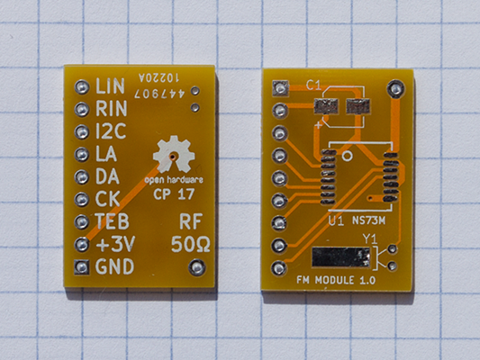

# NS73M-Breakout
2017 Conor Peterson (conor.p.peterson@gmail.com)

License: Creative Commons Attribution International 4.0 (CC-BY-4.0)

This is a breakout board for the Niigata Seimitsu NS73M FM transmitter chip. It
is based on a now-discontinued board formerly available from Sparkfun. Besides
the transmitter itself, there are pads for a crystal and SMT electrolytic
capacitor. Build note: the solder pad under the crystal body is intended to help
mechanically secure the package. 

Dimensions: 25mm x 17mm

Layers: 2

## Bill of Materials
```
| Ref | Spec          | Manu               | Manu Part        | Digikey #    |
| C1  | 22uF 10v      | Panasonic          | EEE-FK1A220R     | PCE3774CT-ND |
| Y1  | 32.768 kHz    | Citizen Finedevice | CFS-20632768DZBB | 300-8301-ND  |
| U1  | RF Xmitter    | Niigata Seimitsu   | NS73M            | N/A          |
| P1  | .100" x 9 pos | Sullins Connector  | PEC09SFAN        | S1212E-09-ND |
```

_Note: for runs of 5 or more, substitute P1 for 40-position breakway header
(e.g. Sullins Connector Solutions PRPC040SAAN-RC, Digikey #S1011EC-40-ND or similar)_